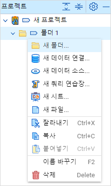
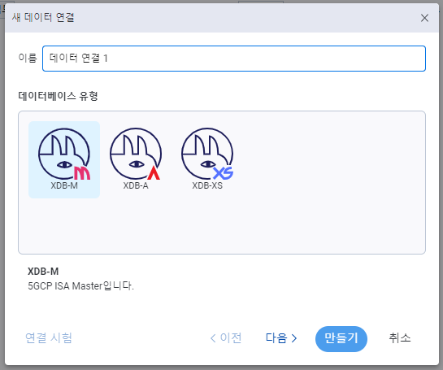

# 새 데이터 연결

데이터 연결을 만들어 놓아야 새로운 데이터 소스를 만들 수 있습니다.  
`XDB-M`, `XDB-A`, `XDB-XS` 중 하나를 선택하여 데이터를 연결할 수 있습니다.

- 원하는 `데이터베이스`를 선택 하고 `다음` 버튼을 클릭합니다.

   

- 선택한 데이터베이스에 해당하는 `서버 주소` 및 `포트 정보`를 입력 한 뒤 `연결 시험`을 클릭합니다.

   

- 연결 시험이 성공하면 `확인` 버튼을 누르고 기존 창으로 돌아와 `만들기`를 클릭합니다
